# Plugin M5Dial

Le plugin **M5Dial** permet d'utiliser des boutons **M5Stack M5Dial** (écran rond, molette, lecteur RFID) comme télécommandes murales pour Jeedom.

Depuis Jeedom, vous pouvez :

- **superviser** chaque bouton (en ligne, version, signal Wi-Fi, mémoire…) ;
- **configurer ses écrans** (lumières, volets, chauffage, présence, capteurs, badges RFID) sans recompiler le firmware ;
- **appairer** un nouveau bouton en quelques secondes, sans mot de passe à saisir ;
- **mettre à jour le firmware** de tous les boutons, depuis Jeedom ou directement depuis GitHub.

Toute la communication passe par **MQTT**.

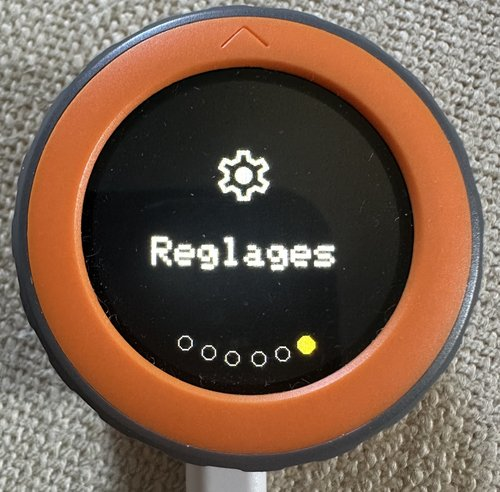

---

## 1. Prérequis

| Élément | Détail |
| --- | --- |
| Jeedom | 4.4 ou plus, Debian 11 ou plus |
| Plugin **MQTT Manager** (mqtt2) | installé, configuré et **démarré** : il fournit le broker et la connexion |
| Utilisateur MQTT | au moins un utilisateur déclaré dans MQTT Manager (champ *Authentification*, format `utilisateur:motdepasse`) |
| Bouton M5Dial | M5Stack Dial v1.1 avec le firmware M5Dial (2.2 ou plus pour l'appairage, 2.3 ou plus conseillé) |
| Wi-Fi | réseau **2,4 GHz**. Sur les bornes Wi-Fi 6 (802.11ax), activez si possible le mode de compatibilité Wi-Fi 5 sur la radio 2,4 GHz : en Wi-Fi 6 pur, le bouton peut perdre beaucoup de paquets (commandes lentes, déconnexions MQTT) |

> Conseil : réservez une adresse IP fixe (bail DHCP) pour chaque bouton sur votre box ou routeur.

---

## 2. Installation et configuration du plugin

1. Installez le plugin (dépôt GitHub `JeromeR60/jeedom-m5dial`, branche `main`), puis **activez-le**.
2. Ouvrez **Plugins → Gestion des plugins → M5Dial → Configuration**.

### Section « Général »

- **Topic racine des boutons** : `m5dial`. Les boutons publient sur `m5dial/<nom>/status` et `m5dial/<nom>/info` et reçoivent leur configuration sur `m5dial/<nom>/config`.
- Le plugin s'abonne automatiquement à ce topic auprès de MQTT Manager.

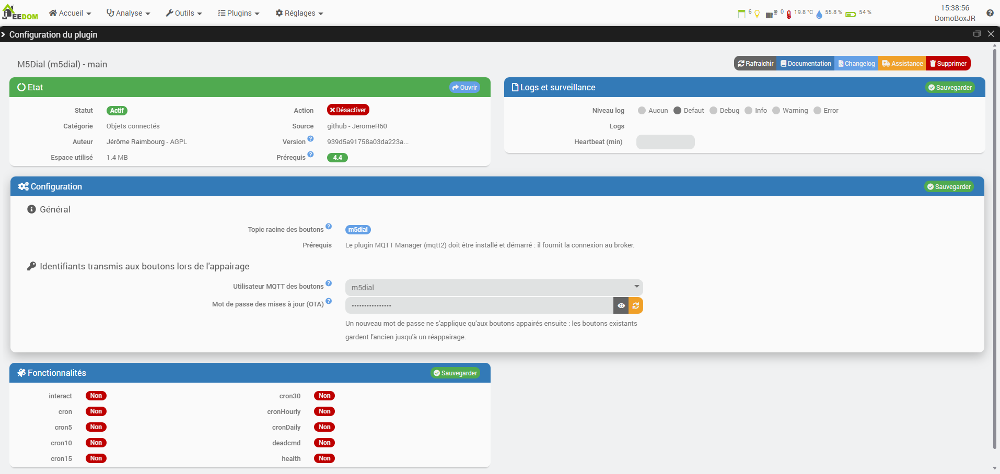

### Section « Identifiants transmis aux boutons lors de l'appairage »

- **Utilisateur MQTT des boutons** : choisissez un utilisateur de MQTT Manager. Son mot de passe est transmis automatiquement au bouton lors de l'appairage : vous n'avez jamais à le saisir.
- **Mot de passe des mises à jour (OTA)** : généré par le plugin à l'installation. L'icône en forme d'œil l'affiche. **Générer un nouveau mot de passe** en crée un autre, qui ne s'applique qu'aux boutons appairés **ensuite** (les autres gardent l'ancien jusqu'à un réappairage).

> Le mot de passe OTA ne sert qu'aux mises à jour depuis PlatformIO (développement). Les mises à jour depuis Jeedom n'en ont pas besoin.

### Section « Mises à jour du firmware »

- **Installer automatiquement les nouvelles versions** (décoché par défaut) : chaque nuit, le plugin vérifie la dernière version publiée. Il vous prévient toujours ; si la case est cochée, il installe aussi la nouvelle version sur les boutons en ligne.
- **Mode avancé (développeur)** : affiche le bouton « Déposer un firmware.bin » pour installer un firmware compilé soi-même.

### Section « Fonctionnalités »

La vérification des nouvelles versions est lancée chaque nuit par la tâche **cronDaily**. Vérifiez qu'elle est sur **Oui** et que la case **Activer** est cochée.

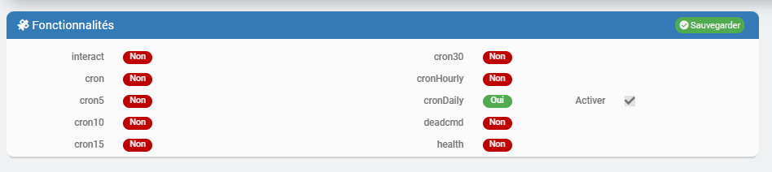

---

## 3. Premier démarrage d'un bouton

### 3.1 Installer le firmware (bouton neuf)

L'installation se fait **depuis le navigateur**, sans logiciel à installer.

1. Sur un ordinateur, ouvrez **Chrome** ou **Edge** à l'adresse **https://jeromer60.github.io/jeedom-m5dial/installer/** et branchez le M5Dial avec un câble **USB-C de données**.

   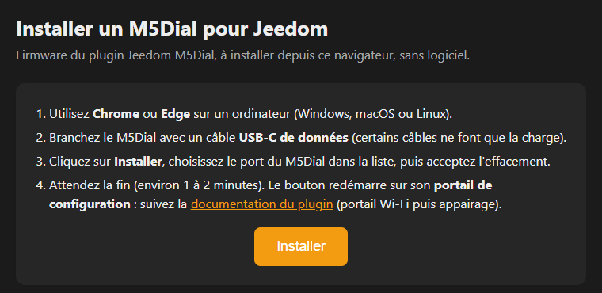

2. Cliquez sur **Installer**, choisissez le port du M5Dial dans la liste du navigateur (souvent « USB JTAG/serial debug unit »), puis **Install M5Dial pour Jeedom**.

   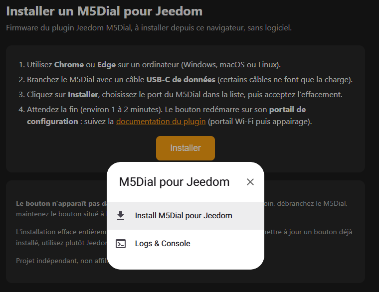

3. Laissez cochée la case **Erase device** (effacement complet, conseillé pour un bouton neuf), puis **Next**.

   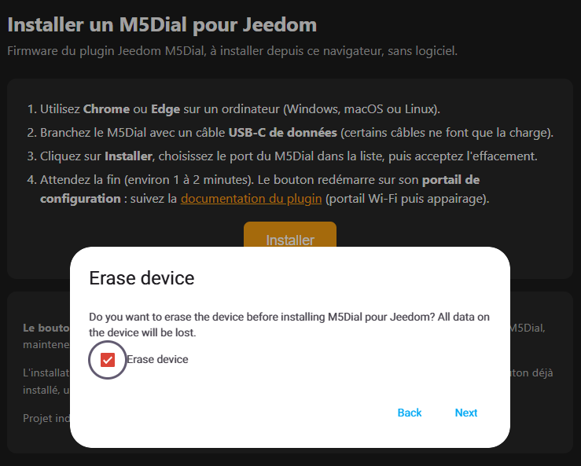

4. Confirmez avec **Install**.

   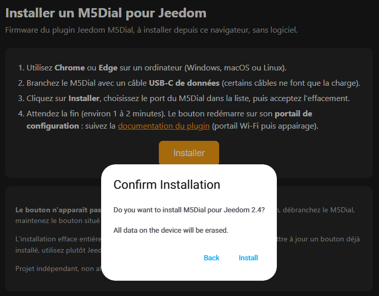

5. Patientez 1 à 2 minutes en gardant la page visible.

   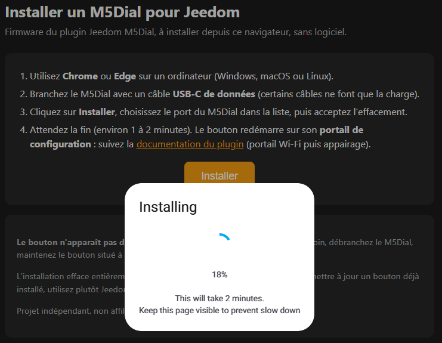

À la fin, le bouton redémarre sur son **portail de configuration** (§3.2). S'il ne redémarre pas, débranchez-le puis rebranchez-le. Les mises à jour suivantes se font depuis Jeedom (voir §6).

> Si le M5Dial n'apparaît pas dans la liste : essayez un autre câble, ou débranchez-le, maintenez le bouton situé à l'arrière, rebranchez-le puis relâchez.

### 3.2 Portail de configuration Wi-Fi

Au premier démarrage (aucun Wi-Fi enregistré), le bouton ouvre son **portail de configuration** :

1. L'écran affiche le nom d'un réseau Wi-Fi (`M5Dial-XXXX`), un mot de passe à 8 chiffres et un **QR code**.
2. Connectez votre téléphone ou ordinateur à ce réseau (en scannant le QR code ou manuellement).
3. Ouvrez **http://192.168.4.1** dans le navigateur.
4. Choisissez votre Wi-Fi dans la liste, saisissez son mot de passe et l'**adresse de Jeedom** (IP du broker MQTT), puis validez.

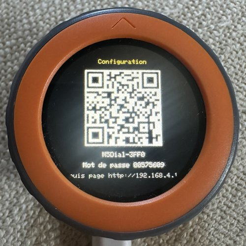 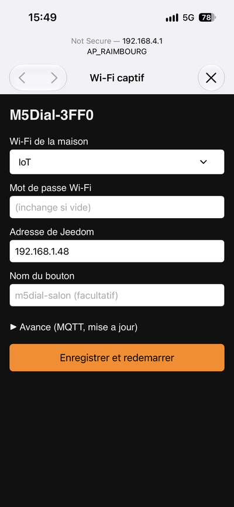

Le bouton redémarre et se connecte à votre réseau.

Le portail se rouvre aussi :

- si le Wi-Fi enregistré reste injoignable pendant 90 secondes ;
- si vous **maintenez le bouton appuyé au démarrage**, pour changer de Wi-Fi ou forcer un réappairage (section *Avancé*, case *Réappairer*).

> Sur iPhone, la page s'ouvre automatiquement dans la fenêtre « Wi-Fi captif ». En cas d'échec, « oubliez » le réseau `M5Dial-XXXX` dans les réglages Wi-Fi puis réessayez.

### 3.3 Appairage avec Jeedom

Si le bouton ne connaît pas encore ses identifiants MQTT, il passe en **appairage** :

1. L'écran du bouton affiche un **code à 4 chiffres**.
2. Dans Jeedom, ouvrez la page du plugin M5Dial : la demande apparaît dans **Nouveaux boutons en attente d'appairage** (nom, adresse MAC, adresse IP, firmware, code).
3. **Vérifiez que le code est identique** à celui affiché sur le bouton, puis cliquez sur **Accepter** (ou **Refuser**).
4. Le bouton reçoit l'utilisateur et le mot de passe MQTT ainsi que le mot de passe OTA, les enregistre dans sa mémoire et redémarre.

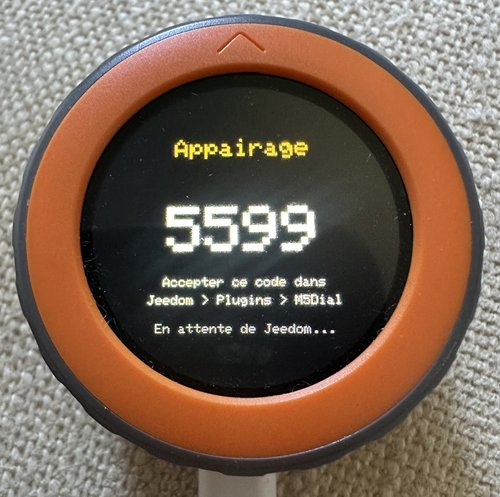

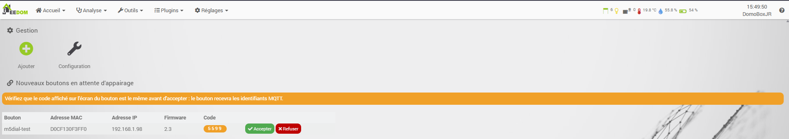

Quelques secondes plus tard, l'équipement est **créé automatiquement** dans Jeedom.

> Un bouton déjà connu de Jeedom (même adresse MAC), par exemple après une réinitialisation, est **reconnu automatiquement** : il retrouve son équipement, ses commandes et sa configuration, même s'il revient sous un autre nom.

---

## 4. Les équipements

Chaque bouton apparaît dans **Mes boutons M5Dial** dès qu'il se connecte au broker. La vignette indique :

- l'**état** : En ligne (pastille verte), Hors ligne ou Jamais vu ;
- la **version du firmware** ;
- la **source de la configuration** (envoyée par Jeedom ou locale au bouton).

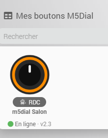

### Onglet « Equipement »

- Paramètres Jeedom habituels : nom, objet parent, catégorie, activer, visible.
- **Nom du bouton** : nom MQTT du bouton (ex. `m5dial-salon`), rempli automatiquement.
- **Identifiant MQTT** : nom suivi des 4 derniers caractères de l'adresse MAC (unique par bouton).
- **Mettre à jour le firmware** : voir §6.

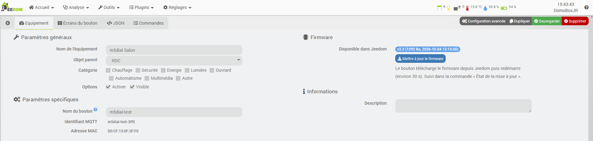

### Commandes

| Commande | Type | Rôle |
| --- | --- | --- |
| En ligne | info binaire | 1 si le bouton est connecté (message de « dernière volonté » MQTT) |
| Version firmware | info texte | version installée sur le bouton |
| Adresse IP | info texte | adresse du bouton sur le réseau |
| Signal Wi-Fi | info numérique (dBm) | qualité du Wi-Fi (bonne au-dessus de −65 dBm) |
| Source de la configuration | info texte | Jeedom ou locale |
| Durée de fonctionnement | info numérique (min) | temps depuis le dernier redémarrage |
| Mémoire libre | info numérique (Ko) | mémoire disponible sur le bouton (historisée) |
| Dernière erreur de configuration | info texte | erreur renvoyée si la configuration reçue est invalide |
| État de la mise à jour | info texte | avancement d'une mise à jour du firmware |
| Envoyer la configuration | action | envoie la configuration de l'équipement au bouton |
| Revenir à la configuration locale | action | efface la configuration envoyée : le bouton reprend son `config.json` interne |
| Mettre à jour le firmware | action | lance la mise à jour avec le firmware disponible dans Jeedom |
| Mise à jour disponible | info binaire | 1 si une version plus récente du firmware est publiée (utilisable dans un scénario) |

Les informations sont rafraîchies toutes les 5 minutes et à chaque reconnexion du bouton.

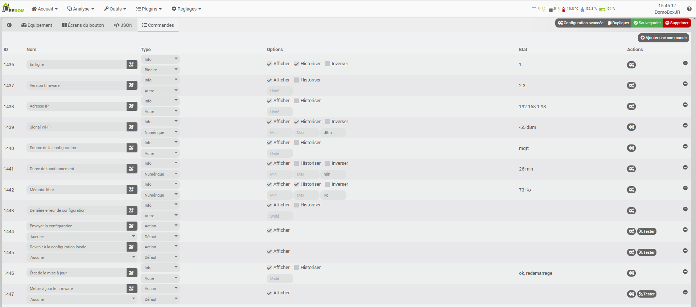

---

## 5. Configurer les écrans d'un bouton

### Onglet « Écrans du bouton »

Cochez les écrans à afficher sur le bouton, puis choisissez les commandes Jeedom avec le sélecteur de commandes.

**Ordre du menu** : le cadre **Menu du bouton**, en haut de l'onglet, liste les écrans cochés. Les flèches ▲▼ changent leur ordre sur le bouton ; le premier est affiché au démarrage. **Réglages** reste toujours en dernier. (Firmware 2.6 ou plus.)

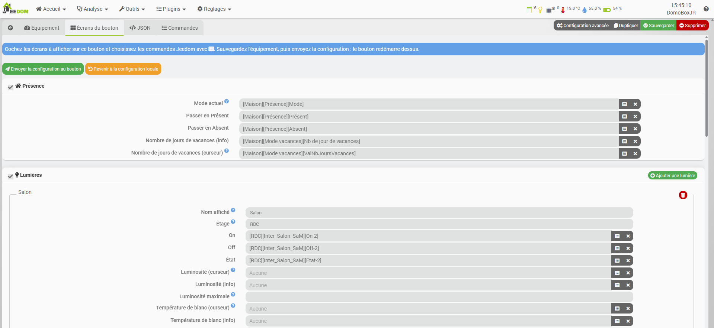

| Écran | Ce qu'on configure |
| --- | --- |
| **Présence** | mode actuel (Présent / Absent / Vacances), actions Présent et Absent, nombre de jours de vacances (info + curseur) |
| **Lumières** | une ligne par lumière : nom affiché, étage, On / Off / État et, en option, luminosité, température de blanc (mireds) et couleur |
| **Volets** | une ligne par volet : nom, étage, position (info et curseur), Monter / Descendre / Stop |
| **Actions groupées** | tout allumer / éteindre, ouvrir / fermer tous les volets ou par étage, heure de fermeture automatique |
| **Chauffage** | température ambiante, consigne (info, curseur, mini, maxi, pas), modes Confort / Nuit / Vacances / Off, statut de chauffe, puissance, température extérieure |
| **Capteurs** | une ligne par pièce : nom, température, humidité |
| **Météo** | température, et en option humidité, icône de la condition, min / max, lever et coucher du soleil (voir §5.2) |
| **Badges RFID** | commande message appelée quand un badge est passé, commande pour enregistrer un nouveau badge, et info qui renvoie le résultat à afficher (voir l'exemple complet au §5.1) |

> Écrivez les noms affichés **sans accents** : la police du bouton ne les contient pas.

Ensuite :

1. **Sauvegardez** l'équipement.
2. Cliquez sur **Envoyer la configuration au bouton** : le bouton l'applique et redémarre sur ses nouveaux écrans.

Pour annuler, **Revenir à la configuration locale** rend au bouton son `config.json` d'origine.

### Onglet « JSON »

Il contient la configuration générée par l'onglet *Écrans du bouton*. Vous pouvez aussi la coller ou la modifier à la main. Sections reconnues : `presence`, `lumieres`, `volets`, `voletPositionFermee`, `groupes`, `chauffage`, `capteurs`, `badges`. La section `device` est ignorée (le bouton garde son nom et son broker). Taille maximale : **8 Ko**.

En cas d'erreur, le bouton garde sa configuration précédente et renseigne la commande *Dernière erreur de configuration*.

### 5.1 Exemple complet : badges RFID et présence

Le bouton **ne décide rien** : il lit le badge et envoie son identifiant (UID) à Jeedom. C'est Jeedom qui sait à qui appartient le badge, change le mode de présence et renvoie le résultat, que le bouton affiche 3 secondes (« Jerome -> Absent », « Badge inconnu… »). La liste des badges est donc entièrement gérée dans Jeedom.

Le bouton lit les badges **13,56 MHz** (Mifare, NFC). Les badges 125 kHz ne sont pas lus.

#### a. Un virtuel « Badges M5Dial »

Créez un équipement **Virtuel** avec ces commandes :

| Nom | Type | Réglage |
| --- | --- | --- |
| Dernier UID | info / autre | **Répéter les valeurs identiques : Oui** (sert de déclencheur) |
| Set UID | action / **message** | Paramètres : met à jour **Dernier UID** avec `#message#` |
| UID à enregistrer | info / autre | **Répéter les valeurs identiques : Oui** (déclencheur) |
| Enregistrer UID | action / **message** | Paramètres : met à jour **UID à enregistrer** avec `#message#` |
| Dernière personne | info / autre | historisée (facultatif) |
| Dernier changement | info / autre | **Répéter les valeurs identiques : Oui** (sinon deux résultats identiques de suite ne sont pas renvoyés et le bouton affiche « Pas de réponse de Jeedom ») |

> Piège du plugin Virtuel : pour qu'une action mette réellement une info à jour, utilisez la colonne **Paramètres** de l'action (choisir l'info, valeur `#message#`). La liste sous le nom de l'action ne sert qu'à l'affichage du widget.

#### b. Une variable avec la liste des badges

Variable de scénario **`badges_m5dial`**, au format texte `UID=Prénom;UID=Prénom`, par exemple :

```
35218FC2=Jerome;A1B2C3D4=Marie
```

UID en majuscules, sans accents dans les prénoms. C'est là qu'on renomme ou supprime un badge (Outils → Scénarios → Variables). Évitez le format JSON : la page des variables l'affiche mal et peut l'écraser.

#### c. Scénario « Bascule présence par badge »

Déclencheur : **#[Maison][Badges M5Dial][Dernier UID]#**.

1. Chercher l'UID reçu dans la variable `badges_m5dial`.
2. **UID inconnu** → mettre `Badge inconnu <UID>` dans **Dernier changement**, et ne rien faire d'autre.
3. **UID connu** → si le mode de présence actuel est « Présent », lancer l'action **Absent**, sinon l'action **Présent**.
4. Mettre le prénom dans **Dernière personne** et `<Prénom> -> <nouveau mode>` dans **Dernier changement**.

#### d. Scénario « Enregistrement d'un badge »

Déclencheur : **#[Maison][Badges M5Dial][UID à enregistrer]#**.

1. UID déjà dans la variable → `Badge deja connu : <Prénom>` dans **Dernier changement**.
2. Sinon → ajouter `<UID>=Badge N` à la variable (nom provisoire à renommer ensuite) et mettre `Nouveau badge : Badge N (<UID>)` dans **Dernier changement**.

#### e. Dans l'onglet « Écrans du bouton »

Section **Badges RFID** :

- **Badge passé (message)** → `[Maison][Badges M5Dial][Set UID]`
- **Enregistrer un badge (message)** → `[Maison][Badges M5Dial][Enregistrer UID]`
- **Dernier changement (info)** → `[Maison][Badges M5Dial][Dernier changement]`

Pour ajouter un badge : sur le bouton, menu **Badges → Ajouter badge**, puis présentez le badge. Renommez-le ensuite dans la variable `badges_m5dial`.

Vous pouvez bien sûr adapter les scénarios : ouvrir une serrure, désarmer une alarme, prévenir sur le téléphone, etc. Le bouton se contente d'envoyer l'UID et d'afficher le texte de **Dernier changement**.

### 5.2 Écran Météo

L'écran Météo affiche une **icône de la condition** (soleil, nuages, pluie, neige, orage…, avec une version de nuit), la **température**, l'**humidité** et une ligne **min / max**. Firmware 2.6 ou plus.

Chaque valeur se choisit avec le sélecteur de commandes : vous pouvez mélanger les sources.

| Champ | Avec le plugin Météo officiel | Autre possibilité |
| --- | --- | --- |
| Température (obligatoire) | Température | sonde extérieure (Zigbee, Z-Wave…) |
| Humidité | Humidité | sonde extérieure |
| Numéro condition | Numéro condition | — (sans ce champ : pas d'icône, le titre « Exterieur » s'affiche) |
| Température min / max | Température Min / Max | toute commande info (ex. statistiques d'un virtuel) |
| Lever / coucher du soleil | Lever du soleil / Coucher du soleil (format HHMM, ex. 758) | — (sans ces champs : icône de jour en permanence) |

Le bouton prend l'heure sur Internet (NTP, heure de Paris) pour choisir l'icône de jour ou de nuit. Les codes de condition reconnus sont ceux du plugin Météo de Jeedom ; un code inconnu affiche l'icône « nuageux ».

---

## 6. Mettre à jour le firmware des boutons

### 6.1 Rendre un firmware disponible dans Jeedom

Sur la page du plugin, section **Firmware des boutons** :

- **Récupérer la dernière version sur GitHub** (recommandé) : télécharge le `firmware.bin` de la dernière release publiée. Ces firmwares sont compilés **sans aucun mot de passe** ; chaque bouton garde ses propres réglages.
- ou, en **mode avancé** uniquement, **Déposer un firmware.bin** : envoie un fichier que vous avez compilé avec PlatformIO.

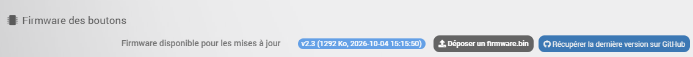

En mode avancé, le bouton **Déposer un firmware.bin** apparaît à côté :

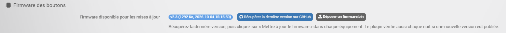

La ligne **Firmware disponible pour les mises à jour** affiche la version, la taille et la date du fichier présent dans Jeedom.

### 6.2 Mettre à jour un bouton

Dans l'équipement, cliquez sur **Mettre à jour le firmware** (ou utilisez la commande action du même nom, par exemple dans un scénario).

Le bouton télécharge le firmware depuis Jeedom, l'installe puis redémarre (environ 30 secondes). La commande **État de la mise à jour** suit l'avancement (pourcentage, `ok, redemarrage` ou message d'erreur). En cas de coupure, le bouton fait jusqu'à 3 tentatives.

La version affichée sur la vignette change dès que le bouton est de retour en ligne.

### 6.3 Être prévenu des nouvelles versions

Chaque nuit, le plugin consulte la dernière version publiée. Si un bouton est en retard :

- un **message Jeedom** l'indique (une seule fois par version) ;
- la vignette affiche un badge **MAJ dispo** ;
- la commande **Mise à jour disponible** passe à 1 (pratique pour une notification par scénario).

Avec l'option **Installer automatiquement les nouvelles versions**, le plugin télécharge le firmware et met à jour lui-même les boutons en ligne.

---

## 7. Topics MQTT (pour information)

| Topic | Sens | Contenu |
| --- | --- | --- |
| `m5dial/<nom>/status` | bouton → Jeedom | `online` / `offline` (retenu, message de dernière volonté) |
| `m5dial/<nom>/info` | bouton → Jeedom | JSON : nom, clientId, version, config, ip, mac, rssi, ssid, uptimeMin, memoireLibreKo (retenu) |
| `m5dial/<nom>/config` | Jeedom → bouton | configuration JSON (retenu) ; message vide = configuration locale |
| `m5dial/<nom>/config/erreur` | bouton → Jeedom | erreur de configuration |
| `m5dial/<nom>/ota` | Jeedom → bouton | `{"url": ..., "version": ...}` : demande de mise à jour |
| `m5dial/<nom>/ota/etat` | bouton → Jeedom | avancement de la mise à jour |

---

## 8. Dépannage

| Symptôme | Que faire |
| --- | --- |
| Le bouton n'apparaît pas dans Jeedom | Vérifier que MQTT Manager est démarré, que le bouton est connecté au Wi-Fi et qu'il a été appairé. Avec MQTT Explorer, vérifier qu'il publie sur `m5dial/#`. |
| Aucune demande d'appairage | Vérifier l'adresse de Jeedom saisie dans le portail ; rouvrir le portail (bouton maintenu au démarrage) et cocher *Réappairer*. |
| Commandes lentes, déconnexions MQTT | Lancer un `ping -t` vers le bouton et vers Jeedom : si seul le bouton perd des paquets, le problème vient du Wi-Fi (Wi-Fi 6 sur 2,4 GHz, signal faible). |
| « La configuration est vide » | Sauvegarder l'équipement avant d'envoyer la configuration. |
| Mise à jour en échec | Vérifier qu'un firmware est disponible (§6.1) et que le bouton est en ligne, puis relancer. |
| Les accents s'affichent mal | Écrire les noms sans accents. |

---

## 9. Sécurité et données

**Ce que le plugin transmet et conserve**

- Le **mot de passe Wi-Fi** est saisi dans le portail du bouton et reste uniquement dans le bouton.
- Lors de l'appairage, Jeedom transmet au bouton l'**utilisateur et le mot de passe MQTT** (repris de MQTT Manager) et le **mot de passe des mises à jour**. Ils sont stockés dans la mémoire du bouton.
- Cette transmission se fait en **HTTP sur votre réseau local** (le bouton ne gère pas le HTTPS). Elle n'a lieu qu'une fois, après votre validation.
- Le plugin conserve pour chaque bouton : son nom, son adresse MAC, son adresse IP, son réseau Wi-Fi (SSID) et sa version. Aucune donnée n'est envoyée en dehors de votre réseau, à part la consultation de la dernière version publiée sur GitHub.

**Protections**

- Aucun mot de passe n'est contenu dans les firmwares publiés.
- L'appairage demande une **validation manuelle** dans Jeedom, avec vérification du code à 4 chiffres affiché sur le bouton. Les identifiants ne sont remis qu'au bouton qui a fait la demande (même adresse MAC, même code, même adresse IP).
- Les mises à jour du firmware utilisent un **jeton à usage limité** (15 minutes), créé à chaque demande. Le bouton n'accepte que les mises à jour venant de l'adresse de Jeedom qu'il connaît.
- Les pages de configuration du plugin sont réservées aux administrateurs Jeedom.

**Conseils**

- Placez les boutons sur un réseau Wi-Fi de confiance (idéalement un réseau dédié aux objets connectés).
- Utilisez un utilisateur MQTT dédié aux boutons.

---

Plugin indépendant, **non affilié à M5Stack**. M5Stack et M5Dial sont des marques de leurs propriétaires respectifs.
